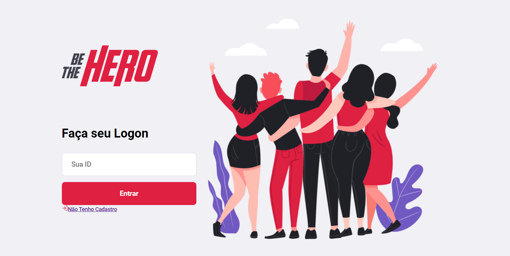
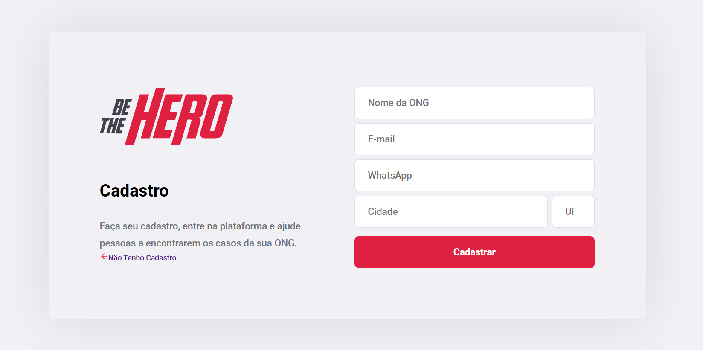
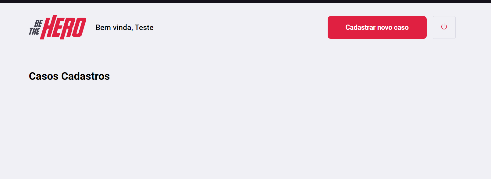
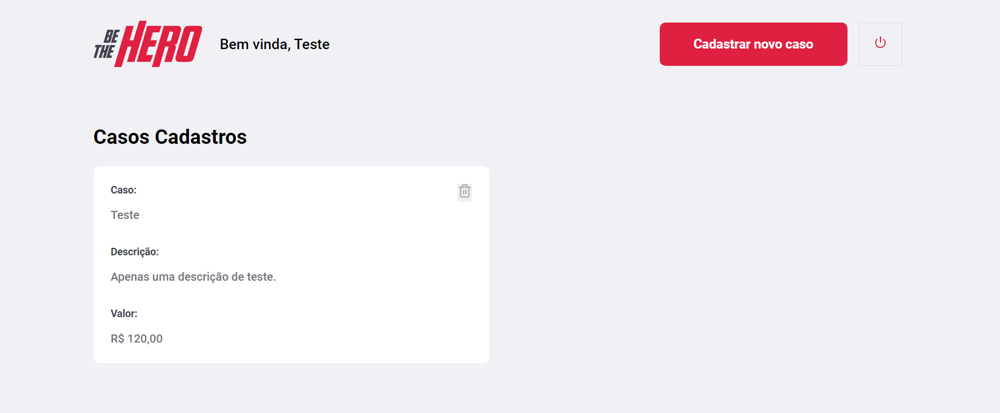
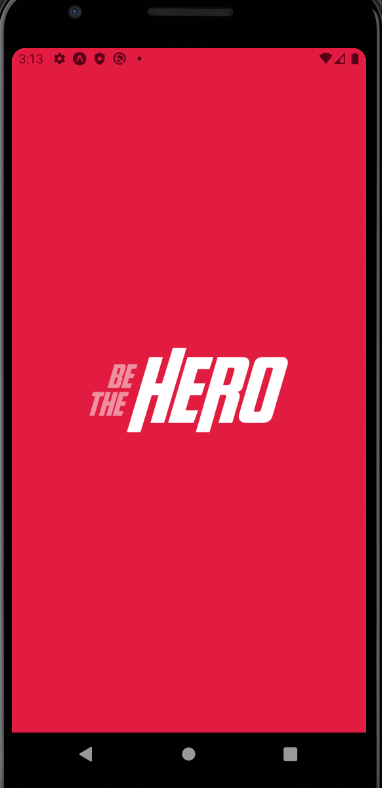
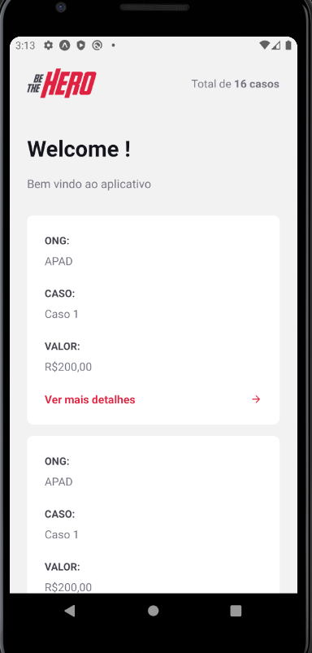
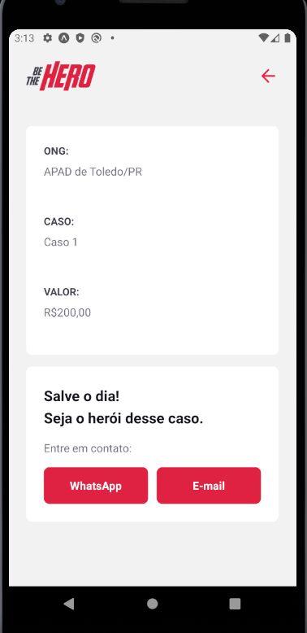

# stackjs

Aplicações desenvolvidas durante a Omnistack disponibilizada pela Rocketseat.

No backend temos a tecnologia NodeJS, no frontend React e no mobile React-Native.

O proposta foi criar uma aplicação onde ONGS possam cadastrar casos para receberem doações.

